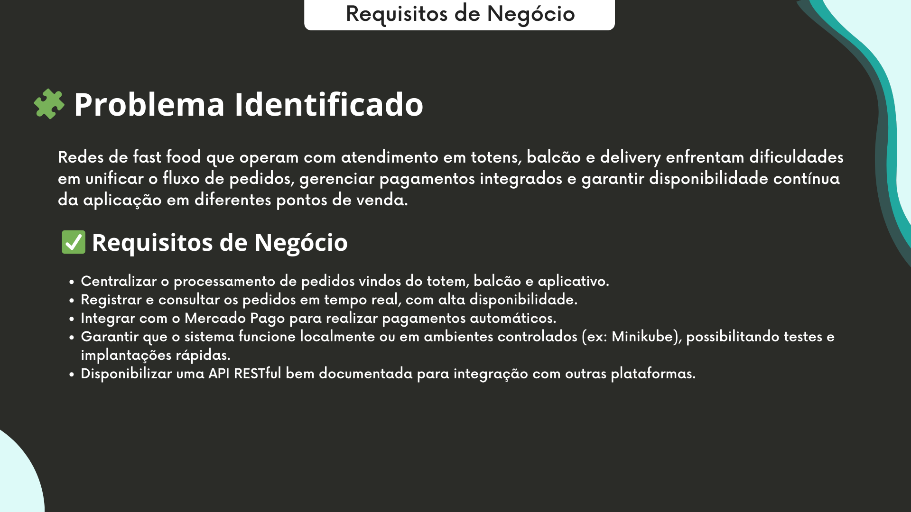
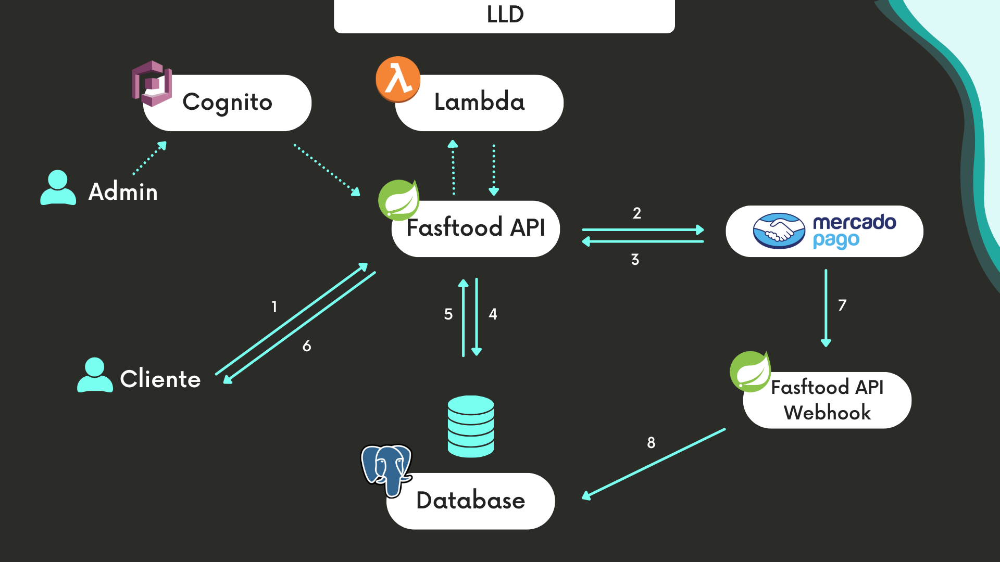
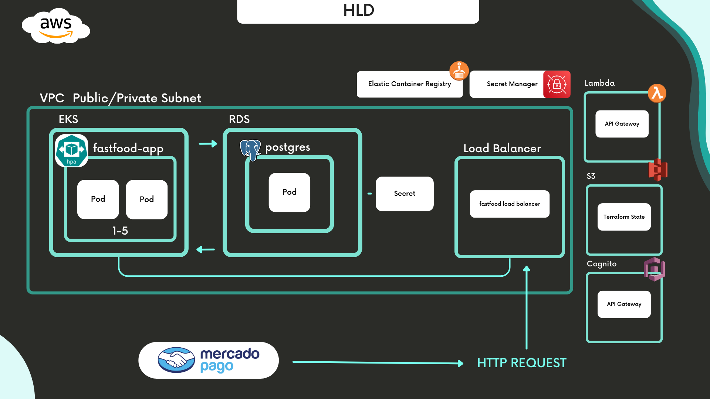
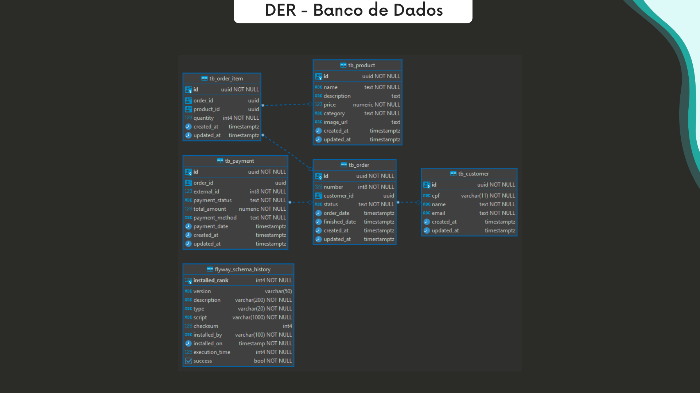

# 🍔 Tech Challenge - FastFood Backend API 🍟

Bem-vindo ao **FastFood Backend Service**! Esta API desenvolvida em Kotlin é responsável por gerenciar as funcionalidades principais de um sistema de gestão de FastFood. 

### 1️⃣ Requisitos de Negócio


---

### 2️⃣ Fluxo de Pedido no Sistema FastFood




### 3️⃣ Arquitetura AWS Cloud




### 4️⃣ DER (Melhoria do Banco de Dados) - Diagrama




---

## 🛠️ Guia Rápido de Inicialização

Este projeto utiliza **Docker Compose** para configurar rapidamente o ambiente com PostgreSQL. Abaixo estão as variáveis de ambiente necessárias para a conexão com o banco. Para começar, crie um arquivo `.env` com base no modelo `.env.sample`.

| Variável                    | Descrição                                                 |
|-----------------------------|-----------------------------------------------------------|
| `DATABASE`                  | Nome do banco de dados que será criado pelo Docker Compose |
| `DATABASE_USER`             | Usuário para autenticação no PostgreSQL                   |
| `DATABASE_PASSWORD`         | Senha do usuário do PostgreSQL                            |
| `DATABASE_PORT`             | Porta para acesso ao PostgreSQL (padrão é `5432`)         |
| `MERCADO_PAGO_ACCESS_TOKEN` | Token de acesso para a sdk do mercado pago                |
| `AUHT_SERVICE_URL`          | URL do Lambda de autenticação de usuário                  |

---

## 🚀 Instruções de Setup (Docker Compose)

1. **Crie seu arquivo `.env`**

   Duplique o `.env.sample` para criar o seu `.env` personalizado:

    ```bash
    cp .env.sample .env
    ```

2. **Atualize suas variáveis**

   Edite o `.env` com os valores desejados:

    ```plaintext
    DATABASE=db_example
    DATABASE_USER=user_example
    DATABASE_PASSWORD=password_example
    DATABASE_PORT=5432
    MERCADO_PAGO_ACCESS_TOKEN=TOKEN
    ```

3. **Suba o ambiente com Docker Compose**

   Deixe o Docker Compose cuidar do resto:

    ```bash
    docker-compose up --build -d
    ```

---

# 🫙 Setup Kubernetes - K8S - Minikube

## 🧱 Pré-requisitos

- [Minikube](https://minikube.sigs.k8s.io/)
- [kubectl](https://kubernetes.io/docs/tasks/tools/)
- [ngrok](https://)

---

## 🐳 Passo 1 – Build das Imagens Locais

Antes de aplicar os manifests do Kubernetes, é necessário construir as imagens Docker localmente e disponibilizá-las para o Minikube.

### 🔹 MacOS/Linux

Execute o script de configuração antes de iniciar o build:

```bash
bash ./setup-infra.sh
```

Caso prefira rodar os comandos manualmente:

```bash
minikube start
eval $(minikube docker-env)
docker build -f infra/db/Dockerfile -t fastfood-postgres:latest .
docker build -t tech-challenge-fastfood:latest .
```

### 🔹 Windows (PowerShell)

Para usuários Windows, execute o script equivalente:

```powershell
./setup-infra.psi
```

Ou execute manualmente:

```powershell
minikube start
Invoke-Expression -Command "$(minikube docker-env | Out-String)"
docker build -f infra/db/Dockerfile -t fastfood-postgres:latest .
docker build -t tech-challenge-fastfood:latest .
```

> **Importante:** Certifique-se de estar na raiz do projeto antes de rodar os comandos.


## 📦 Passo 2 – Aplicar os manifests Kubernetes

Com todos os `.yaml` dentro da pasta `k8s`, rode:

```bash
kubectl apply -f k8s/
```

> Isso criará: PV, PVC, Secrets, ConfigMaps, Services, Deployments e Ingress para a aplicação e o banco.

Se você já rodou antes e quer reiniciar do zero:
```bash
kubectl delete deployment postgres fastfood-app
kubectl delete pvc postgres-pvc
kubectl delete pv postgres-pv
kubectl apply -f k8s/
```

---

## 🐘 Passo 4 – (Opcional) Acessar o PostgreSQL via DBeaver

### Opção 1 – Usando `kubectl port-forward` (Recomendado)

1. Descubra o nome do pod do PostgreSQL:
```bash
kubectl get pods
```

2. Redirecione a porta local:
```bash
kubectl port-forward pod/<nome-do-pod> 5432:5432
```

3. Configure no DBeaver:
```
Host: localhost
Port: 5432
Database: fastfood_db
Usuário: fastfood
Senha: Teste123
```

> Deixe o terminal aberto enquanto estiver usando o DBeaver.

---

### Opção 2 – Usando NodePort (menos seguro)

Altere `postgres-service.yaml`:
```yaml
spec:
  type: NodePort
  ports:
    - port: 5432
      targetPort: 5432
      nodePort: 30032
```

Descubra o IP do Minikube:
```bash
minikube ip
```

Use no DBeaver:
```
Host: <IP do Minikube>
Porta: 30032
Database: fastfood_db
Usuário: fastfood
Senha: Teste123
```

---

## ✅ Verificações úteis

- Verificar pods:
```bash
kubectl get pods
```
- Logs do banco:
```bash
kubectl logs deployment/postgres
```
- Verificar PVC e PV:
```bash
kubectl get pvc
kubectl get pv
```
- Logs da aplicação:
```bash
kubectl logs deployment/fastfood-app
```
- Abrir painel do Kubernetes:
```bash
minikube dashboard
```

---

## 📌 Observações

- O script SQL só roda na **primeira vez**, quando o volume está limpo.
- Para forçar nova execução:
```bash
kubectl delete pvc postgres-pvc
kubectl delete pv postgres-pv
```
- O banco é acessado internamente via `postgres-service`.
- Variáveis da aplicação estão nos `ConfigMaps` e `Secrets`.
- O Ingress permite acesso via: http://springboot.local.com (adicione no `/etc/hosts`: `127.0.0.1 springboot.local.com`)
---

## 🌐 Acesso à aplicação

---

### 🚀 Verificando a URL pública gerada

O ngrok gerou uma url pública para acessar a sua aplicação

```bash
kubectl logs deployment/ngrok
```

Você verá algo como 
``
t=2025-03-22T22:50:50+0000 lvl=info msg="started tunnel" obj=tunnels name=fastfood addr=http://ingress-nginx-controller.ingress-nginx:80 url=https://fb82-189-68-138-48.ngrok-free.app
``

A aplicação estará também estará disponível em:`http://springboot.local.com` (via Ingress).
ou `http://localhost:8080` (via Docker Compose)


Para descobrir o endereço se não usar `/etc/hosts` e nem quiser utilizar a url pública gerada pelo ngrok:
```bash
minikube ip
```

Use:
```
http://<IP_DO_MINIKUBE>
```

---

## 🔗 Integração com Spring Boot

O serviço Spring Boot lê automaticamente as variáveis de ambiente para configurar a conexão com o banco. Com o `.env` correto ou os `Secrets` e `ConfigMaps` no K8S, a integração funciona automaticamente.

---

## 🧑‍💻 Documentação Swagger

A API FastFood está documentada via **Swagger UI**. Para acessar:

1. Garanta que a aplicação está rodando.
2. Acesse:

Docker
```plaintext
http://localhost:8080/swagger-ui
```
Ou, se estiver rodando via Minikube (K8S):

```plaintext
http://<IP_DO_MINIKUBE>/swagger-ui
```

Ingress
```plaintext
http://springboot.local.com/swagger-ui
```

---

## 💡 Dicas e Solução de Problemas

- **Erro ao conectar com o banco?** Verifique se o Docker Compose ou Minikube estão rodando corretamente.
- **Variáveis de ambiente não reconhecidas?** Verifique se o `.env` está carregado corretamente ou se os ConfigMaps/Secrets estão aplicados.

Agora você está pronto para codar, testar e gerenciar sua aplicação FastFood com estilo! 🚀🍔🍟

## 📽️ Vídeo da Apresentação

[](https://www.youtube.com/watch?v=Dht0kPP9SiA)  
